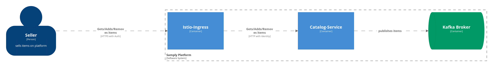

# architecture


## Local Setup

```bash
minikube start --kubernetes-version v1.15.2
helm init

kubectl apply -f k8s/keycloak-pv.yaml

helm install --name keycloak \
  --values k8s/keycloak-values.yaml \
  codecentric/keycloak --wait

helm install --name kafka incubator/kafka --wait

helm install --name kafka-schema-registry \
  --set kafka.enabled="false" \
  --set kafkaStore.overrideBootstrapServers="PLAINTEXT://kafka-headless:9092" \
  incubator/schema-registry --wait
```

DONT USE "schema-registry" AS RELEASE NAME!!!!

### Setup Keycloak

* Create realm `samply`
* Create confidential client `catalog-api`
* Create `seller` role and group
* Create sample seller user
* Add `http://localhost:8080` as web origin to client settings

### Check events

```
kubectl exec -it kafka-schema-registry-84b9b84dcf-c5nkm -- sh -c "JMX_PORT=6767 kafka-avro-console-consumer --bootstrap-server kafka-headless:9092 --topic item-created-log --from-beginning"
```